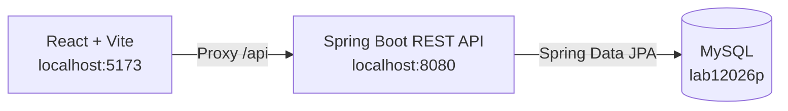

# Aplicación Banco — Laboratorio 01 de Arquitectura de Software

Aplicación web full stack para administrar clientes bancarios, realizar transferencias entre cuentas y consultar el historial de movimientos. El proyecto combina una API REST construida con Spring Boot, una interfaz en React y persistencia en MySQL.

## Funcionalidades

- Crear clientes con nombre, apellido, número de cuenta y saldo inicial.
- Consultar todos los clientes registrados y sus saldos.
- Transferir dinero entre dos cuentas existentes.
- Validar montos, cuentas diferentes y saldo suficiente antes de cada transferencia.
- Consultar los movimientos de una cuenta, identificando entradas y salidas.


## Arquitectura



El backend sigue una arquitectura por capas:

- **Controllers:** exponen los endpoints HTTP.
- **Services:** contienen las reglas de negocio y el manejo transaccional.
- **Repositories:** gestionan el acceso a datos con Spring Data JPA.
- **Entities y DTOs:** representan la información persistida y los contratos de la API.
- **Mappers:** convierten entidades y DTOs mediante MapStruct.

## Tecnologías

| Componente | Tecnología |
| --- | --- |
| Backend | Java 17, Spring Boot 3.5.11, Spring Web |
| Persistencia | Spring Data JPA, Hibernate, MySQL |
| Mapeo | MapStruct 1.5.5.Final |
| Frontend | React 19, Vite 8, Axios |
| Construcción | Maven Wrapper, npm |
| Pruebas | JUnit 5, Spring Boot Test |

## Estructura del proyecto

```text
.
├── src/
│   ├── main/java/com/udea/lab12026p/
│   │   ├── controller/     # Endpoints REST
│   │   ├── dto/            # Objetos de transferencia de datos
│   │   ├── entity/         # Entidades JPA
│   │   ├── mapper/         # Conversión entre entidades y DTOs
│   │   ├── repository/     # Acceso a MySQL
│   │   └── service/        # Lógica de negocio
│   ├── main/resources/     # Configuración de Spring Boot
│   └── test/               # Pruebas del backend
├── frontend/
│   ├── src/api/            # Cliente HTTP
│   ├── src/pages/          # Clientes, transferencias e historial
│   └── package.json
├── pom.xml
└── mvnw
```

## Requisitos previos

- Java 17.
- MySQL 8.
- Node.js `20.19+`, `22.12+` o una versión posterior compatible con Vite 8.
- npm.

No es necesario instalar Maven globalmente porque el proyecto incluye Maven Wrapper.

## Configuración de la base de datos

La aplicación utiliza la base de datos `lab12026p` y el usuario `lab_user`. Desde MySQL, crea ambos con:

```sql
CREATE DATABASE IF NOT EXISTS lab12026p;
CREATE USER IF NOT EXISTS 'lab_user'@'localhost' IDENTIFIED BY 'tu_contrasena';
GRANT ALL PRIVILEGES ON lab12026p.* TO 'lab_user'@'localhost';
FLUSH PRIVILEGES;
```

La contraseña no se guarda en el repositorio. Antes de iniciar el backend, define la variable de entorno `DB_PASSWORD` con la misma contraseña:

```bash
export DB_PASSWORD='tu_contrasena'
```

En PowerShell:

```powershell
$env:DB_PASSWORD = 'tu_contrasena'
```

Hibernate crea o actualiza automáticamente las tablas al iniciar la aplicación porque `spring.jpa.hibernate.ddl-auto` está configurado como `update`.

## Ejecución local

### 1. Iniciar el backend

Desde la raíz del proyecto:

```bash
./mvnw spring-boot:run
```

En Windows:

```powershell
mvnw.cmd spring-boot:run
```

La API queda disponible en `http://localhost:8080`.

### 2. Iniciar el frontend

En otra terminal:

```bash
cd frontend
npm ci
npm run dev
```

Abre `http://localhost:5173`. Durante el desarrollo, Vite redirige las solicitudes realizadas a `/api` hacia el backend en el puerto `8080`.

## API REST

| Método | Endpoint | Descripción |
| --- | --- | --- |
| `GET` | `/api/customers` | Lista todos los clientes. |
| `GET` | `/api/customers/{id}` | Consulta un cliente por su identificador. |
| `POST` | `/api/customers` | Crea un cliente. |
| `POST` | `/api/transactions` | Realiza una transferencia. |
| `GET` | `/api/transactions/account/{accountNumber}` | Consulta los movimientos de una cuenta. |
| `GET` | `/api/transactions` | Lista todas las transacciones. |
| `GET` | `/api/transactions/{id}` | Consulta una transacción por su identificador. |
| `PUT` | `/api/transactions/{id}` | Actualiza una transferencia y ajusta los saldos involucrados. |
| `DELETE` | `/api/transactions/{id}` | Elimina una transferencia y revierte sus saldos. |

### Crear un cliente

```bash
curl -X POST http://localhost:8080/api/customers \
  -H 'Content-Type: application/json' \
  -d '{
    "firstName": "Ana",
    "lastName": "Gómez",
    "accountNumber": "10001",
    "balance": 150000
  }'
```

### Realizar una transferencia

Antes de ejecutar este ejemplo deben existir las cuentas `10001` y `10002`.

```bash
curl -X POST http://localhost:8080/api/transactions \
  -H 'Content-Type: application/json' \
  -d '{
    "senderAccountNumber": "10001",
    "receiverAccountNumber": "10002",
    "amount": 25000
  }'
```

La transferencia se rechaza cuando falta una cuenta, ambas cuentas son iguales, el monto no es positivo, una cuenta no existe o el remitente no tiene saldo suficiente.

### Consultar movimientos

```bash
curl http://localhost:8080/api/transactions/10001
```

## Verificación

Con MySQL en ejecución y `DB_PASSWORD` configurada, ejecuta las pruebas del backend:

```bash
./mvnw test
```

Para validar el frontend:

```bash
cd frontend
npm run lint
npm run build
```

## Configuración principal

- `src/main/resources/application.properties`: conexión a MySQL, puerto y configuración de JPA.
- `frontend/vite.config.js`: puerto del frontend y proxy hacia la API.
- `frontend/src/api/banco.js`: funciones utilizadas por React para consumir el backend.
